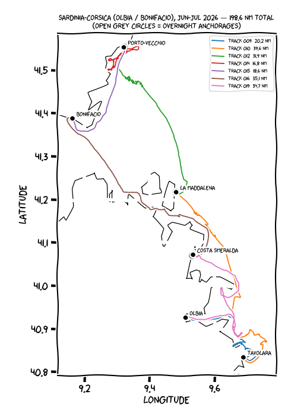

# Pimp your Charts with the fancy XKCD Style

You like the cool [XKCD](http://xkcdgraphs.com/) Look and Feel of the teaser chart?
Then this repo/post is what you are looking for!


This repo is a companion of the post [Pimp your Charts with the fancy XKCD Style](https://devops.datenkollektiv.de/pimp-your-charts-with-the-fancy-xkcd-style.html).

Please check the post mentioned above for more details.

## For the Impatient

> [jupyterhub](https://jupyter.org/hub) - A multi-user version of the notebook designed for companies, classrooms and research labs

Task automation lives in a [`justfile`](https://github.com/casey/just) — run `just --list` to see everything.

### With `just` (Docker Compose)

```shell
just up      # start JupyterLab (:8888, token 'xkcd') + MinIO, detached
just open    # open the Lab in your browser (token pre-filled)
just down    # stop and remove the containers
```

Other handy recipes: `just build` (rebuild the image after editing the `Dockerfile`),
`just rebuild` (build + restart), `just logs`, and `just validate` (run the sailing
logbook notebook end-to-end in the image as a smoke test).

> Note: The token of this setup is `xkcd`! Visit [http://localhost:8888/](http://localhost:8888/).

Plain Docker Compose (`docker compose up`) still works if you prefer not to use `just`.

The MinIO web console is on [http://localhost:9001/](http://localhost:9001/) (S3 API on `:9000`).
If port `9001` (or `9000`) is already taken on your machine, override it without editing any
file: `MINIO_CONSOLE_PORT=9101 just up` (or `MINIO_API_PORT=9100`).

### With Minikube

```shell
just minikube-build     # eval $(minikube docker-env) && docker build -t xkcd-notebook .
just minikube-deploy    # namespace + aws-credentials secret + kubectl apply -f k8s/
just minikube-forward   # port-forward the notebook pod to localhost:8888
```

`just minikube-deploy` expects `.aws/credentials` to exist locally (mounted as a secret).

> Note: The token of this setup is `xkcd`!

Visit your local jupyterhub [http://localhost:8888/](http://localhost:8888/).

## Kick-off Graphviz

Empower the setup with [graphviz](https://graphviz.org/)

```Dockerfile
RUN apt-get install graphviz
RUN pip install graphviz
```

Check the [Introduction to Graphviz in Jupyter Notebook](https://h1ros.github.io/posts/introduction-to-graphviz-in-jupyter-notebook/) for more in-depth information.

## Read data from an S3 bucket

We use [boto3](https://pypi.org/project/boto3/) to interact with an S3 bucket.

```Dockerfile
RUN pip install boto3
```

Link your `.aws/credentials` into the container like follows:

```yaml
services:
  xkcd-jupyterhub:
    volumes:
     - .aws/credentials:/home/jovyan/.aws/credentials
```

[](https://boto3.amazonaws.com/v1/documentation/api/latest/reference/services/s3.html#bucket)

## Tap into Apache Spark with Jupyter

Pimp the current setup:

```Dockerfile
RUN pip install findspark
```

Inside your Jupyter notebook:

```Python
import findspark
```

## Sailing logbook from GPX tracks

`work/logbook/navionics_logbook.ipynb` turns [Navionics Boating App](https://www.navionics.com/)
GPX exports into per-trip summary tables, XKCD-style route maps with a simplified
coastline, an optional interactive [folium](https://python-visualization.github.io/folium/)
map, and speed profiles.



```Dockerfile
RUN pip install folium
RUN pip install shapely
```

The coastlines in `work/logbook/coastlines/*.geojson` (derived from
[Natural Earth](https://www.naturalearthdata.com/) 1:10m) are committed. The GPX
exports are large and **gitignored** — place your own exports in `work/datasets/`
under the filenames referenced in the notebook's `TRIPS` dict.

## Finally Machine Learning with `scikit-learn`

[`scikit-learn`](https://scikit-learn.org/stable/)
